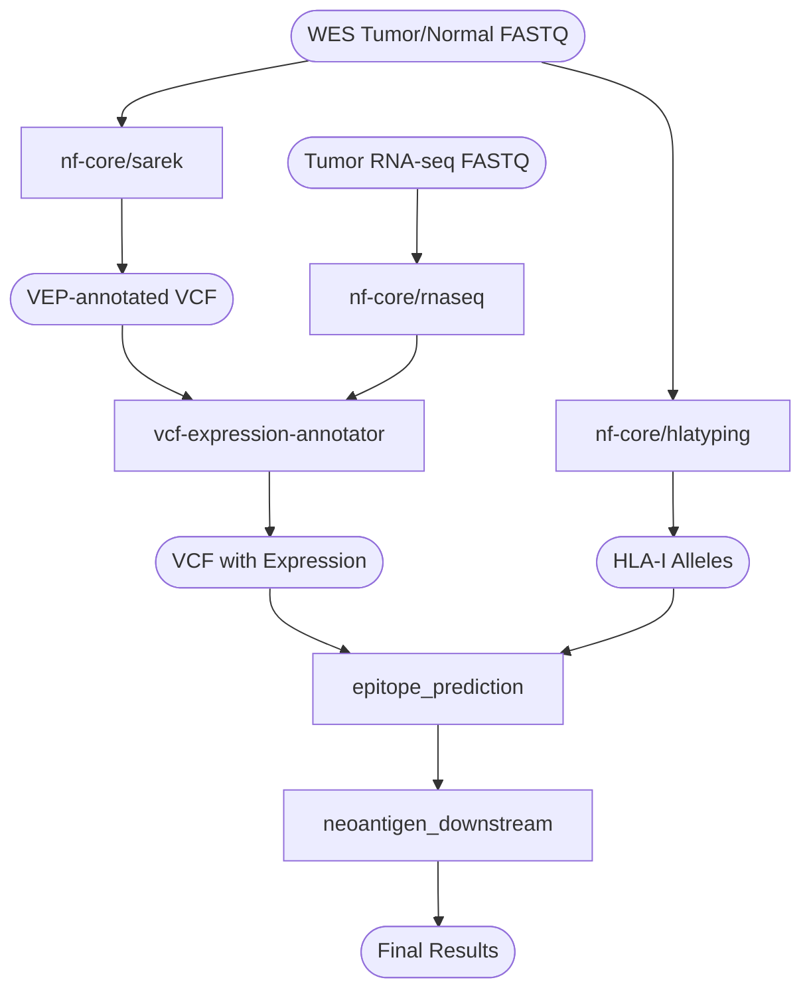

# Neoantigen Prediction

This repository is a working draft of a set of analyses to identify candidate neoantigens for personalized cancer vaccines from tumor-normal WES + RNA-seq data.

## Key Attributes for Neoantigen Prioritization

To effectively identify and prioritize candidate neoantigens for personalized cancer vaccines (PCVs), several biological and computational criteria are considered:

- **Somatic variants:**  
  The peptide must be unique to the tumor (not germline). T cells undergo negative selection in the thymus if they recognize and bind too strongly to neoepitopes expressed on normal cells. To identify somatic mutations, tumor and normal WES data are processed with the `nf-core/sarek` pipeline, generating a VEP-annotated VCF file. This involves SNV/Indel calling (Mutect2, Strelka) and somatic copy number analysis (CNVkit). For now, only the Mutect2-annotated VCF is used for downstream analysis.

- **Variant expression:**  
  The variant must be expressed in the tumor to be presented on the HLA-I receptor. Tumor RNA-seq data is quantified using `nf-core/rnaseq` (STAR-Salmon). The `vcf-expression-annotator` from vatools annotates the VCF with transcript-level expression. Previous studies have used TPM cutoffs (e.g., 0.01) to filter candidates. The annotated VCF is converted to CSV using `/scripts/vcf_expression_annotator/vcf_to_csv.py`.

- **Binding affinity:**  
  The patient's HLA-I alleles must have adequate predicted binding affinity with the neopeptide. HLA-I typing is performed with `nf-core/hlatyping` (OptiType). The HLA-I results and the annotated VCF (optionally cleaned with `/scripts/epitope_prediction/clean_vep_ann_vcf.py`) are input to `nf-core/epitopeprediction`, which predicts HLA-I/peptide binding affinity using mhcflurry. The key output is `mhcflurry_affinity_percentile`, with strong binders defined as rank < 0.5.

- **Clonality:**  
  **Under development.** We aim to estimate the fraction of cancer cells exhibiting each variant and peptide, as tumors are often heterogeneous. Clonal driver mutations should have a cancer cell fraction of 100%. PureCN can estimate the clonality of each variant.

---

## Workflow Overview

### Step-by-step Explanation

1. **Somatic Variant Calling:**  
   - **Input:** Tumor and normal WES FASTQ files  
   - **Tool:** `nf-core/sarek` pipeline (Mutect2/VEP)  
   - **Output:** VEP-annotated VCF file containing somatic variants

2. **HLA-I Typing:**  
   - **Input:** Tumor and/or normal WES FASTQ files  
   - **Tool:** `nf-core/hlatyping` (OptiType)  
   - **Output:** HLA-I allele calls for the patient

3. **RNA-seq Quantification:**  
   - **Input:** Tumor/Normal RNA-seq FASTQ  
   - **Tool:** `nf-core/rnaseq` (STAR-Salmon)  
   - **Output:** Gene and transcript-level expression quantification

4. **Expression Annotation:**  
   - **Input:** VEP-annotated VCF and RNA-seq quantification  
   - **Tool:** `vcf-expression-annotator` from vatools  
   - **Output:** VEP-annotated VCF with variant expression

5. **VCF to CSV Conversion:**  
   - **Input:** VEP-annotated VCF with variant expression  
   - **Tool:** `vcf_to_csv.py`  
   - **Output:** Variant expression CSV

6. **Epitope Prediction:**  
   - **Input:** VEP-annotated VCF (with or without expression) and HLA-I alleles  
   - **Tool:** `epitope_prediction` (mhcflurry)  
   - **Output:** Epitope prediction TSV

7. **Downstream Analysis:**  
   - **Input:** Variant expression CSV and epitope prediction TSV  
   - **Tool:** `neoantigen_downstream.py`  
   - **Output:** Final merged CSVs and plots for candidate neoantigen prioritization

---
